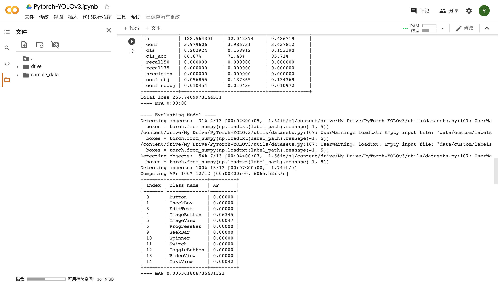

# AutomatedTesting2020

姓名：杨雨辰

学号：181250174

选题方向：移动应用自动化测试

***

## 模型分析

### 模型结构

本次大作业，决定采取基于大量GUi数据学习的深度学习模型，而摒弃传统的基于图像处理特征的方法。根据Chen等人的论文后者的准确率较前者更高，而对于论文中的两者结合的方法，本次大作业由于各方面条件限制，不做考虑。

1. 数据预处理

深度学习模型的首要难题是大量精准标注的数据，而对于给定的1004张jpg文件构成的数据集，我首先寻找了Rico数据集的标注版本，未果；其次寻找半自动标注方法，但是各方法对以json格式作为控件解析的文本文件适配性不好；再考虑使用`labelImg`工具进行手工标注，但是对于大量的重复工作，我感到比较劳累；最终选择放弃预标注，采取过滤识别方法。

对于给定的Rico数据集，每张jpg文件对应了一个json文件，在json文件中每个控件有很多个字段，而其中的`class`和`bounds`字段，分别代表了该控件的种类以及它的左上边界点和右下边界点的x、y坐标。因此在依次分析对应的jpg和json文件，同时过滤掉不可见、不符合边界检验的组件，并根据class中的内容识别分类出该控件的种类，将坐标换算成对应的复合YOLO的格式。

2. One-stage模型 YOLOv3

在三中模型（Faster-RCNN、YOLO、CenterNet）当中选择YOLO也是因为

| 模型 | 类型 | 特点 |
| :----: | :----: | ---- |
| Faster-RCNN | 2-stage | 精度高，速度慢，训练开销大|
| YOLO | 1-stage | 检测速度快，泛化能力好，准确率较高 |
| CenterNet | 无 anchor 检测 | 模型结构小，速度较快，精度较高 |

cr. 移动大作业补充说明.pdf

### 运行步骤

1. 在`main.py`中运行`main()`

- 在`annotations`文件夹中生成YOLO需要的每张jpg文件的txt格式的解析文件；(也就是第一阶段的产物)
- 同时在config文件夹生成划分后的数据集`train.txt`和`valid.txt`

2. 模型准备

- 使用`Google Colab`进行GPU加速，可使用`Pytorch_YOLOv3.ipynb`
- 按照参考3中的Installation指导，安装YOLOv3（请务必使用本仓库中的PyTorch-YOLOv3而不要使用参考3地址中的，因为直接运行将产生大量错误！）
- 按照参考3中的Train on Custom Dataset指导
	- 将`classes.names`（这里使用Chen论文中的15个分类）放到Pytorch-YOLOv3项目的`data/custom/`中
	- 将jpg文件放到`data/custom/images/`；
	- 将`annotations`文件夹下的所有文件放到`data/custom/labels/`中
	- 将`train.txt`和`valid.txt`放到`data/custom`中

3. 训练模型

运行`!python3 train.py --model_def config/yolov3-custom.cfg --data_config config/custom.data --pretrained_weights weights/darknet53.conv.74`，将会在`checkpoints`文件夹中生成多个`.pth`文件

我训练出的模型在`PyTorch-YOLOv3/checkpoints/yolov3_ckpt_13.pth`（也就是第二阶段的产物）

4. 使用模型进行检测

运行`!python detect.py --image_folder data/samples/ --weights_path checkpoints/yolov3_ckpt_13.pth --model_def config/yolov3-custom.cfg --class_path data/custom/classes.names`，将在`output`文件夹中生成多个png文件，并在`textOutput`中输出txt格式的解析文件（但是可能我改了YOLOv3原来的代码之后就出问题了，并不能输出正确的png和txt😭，我修改的在detect.py中注释的地方）

### 相关参考文献

1. Chen J, Xie M, Xing Z, et al. Object detection for graphical user interface: old fashioned or deep learning or a combination?[C]//Proceedings of the 28th ACM Joint Meeting on European Software Engineering Conference and Symposium on the Foundations of Software Engineering. 2020: 1202-1214.

2. https://github.com/tzutalin/labelImg

3. https://github.com/eriklindernoren/PyTorch-YOLOv3

## 实验验证

### 评估指标及含义

使用了YOLO模型自带的`test.py`中的评估方法，在每个epoch后会自动进行评估，值得注意的是该模型对ImageButton、ImageView、TextView识别得比较好，而对其他的控件类型辨识度很低。

### 验证结果

模型的识别准确率，一般在55%左右浮动（视频中有体现）

## 结果示例

很遗憾，不知道为什么`output`中识别成功的png不多

## 个人感想

选择了移动应用自动化测试的初衷是因为我综合考虑了三个方向的大作业发现对该题比较感兴趣，我也知道它会比较难，但是我觉得还是可以试一试的。但是现在我觉得CV确实比我想象的更加复杂，说实话选择深度学习模型也就是一定程度上避开了复杂识别算法的实现，但是现在看来结果并不理想。